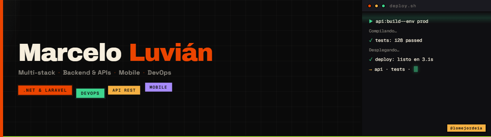

  

  

---

## Hola, soy Marcelo

Soy programador y me apasiona la tecnología. Llevo años construyendo software de verdad: backend y APIs en **.NET** y **Laravel**, apps móviles, y todo el camino hasta el **DevOps** y el deploy.

Me gusta construir y optimizar procesos — y cuando una herramienta me hace más rápido, la uso (sí, la IA entre ellas, como una más del kit). Aprendo en cada proyecto y comparto lo que voy descubriendo.

---

## Stack y herramientas

**Backend & APIs**

  
  
  

**Mobile**

  
  

**Data**

  
  

**DevOps & Automatización**

  
  
  
  

**IA como herramienta**

  
  

---

## Comparto lo que aprendo

Soy creador de **[@lomejordeia](https://instagram.com/lomejordeia)** — noticias tech, herramientas, avances de IA y mucho más, en formato directo y al grano. Si te late estar al día sin relleno, ahí nos vemos.

En lo personal me encuentras como **[@marceloluvian](https://instagram.com/marceloluvian)**.

  
  &nbsp;
  

---

  
    <code>La tecnología es la herramienta, no el fin. Sigo construyendo y aprendiendo.</code>
  

